# คู่มือการใช้งาน วงเงินอเนกประสงค์ / Multi-purpose Credit Line — User Manual

**Version:** UAT · สินเชื่อเพิ่มจากสัญญาเดิม (P-Loan Extra) · web 61–62  
**Url:** sawad-loan-universal-uat.web.app  
**Date:** 2026-08-04  

## เกี่ยวกับเอกสารนี้ / About this document

**TH** คู่มือนี้อธิบายการขอ “วงเงินอเนกประสงค์” — การขอสินเชื่อเพิ่มจากสัญญาที่ท่านมีอยู่แล้ว จัดกลุ่มตามขั้นตอน หมายเลขหลักคือกลุ่ม หมายเลขย่อยคือหน้าจอ ตัวเลขบนภาพ (1) (2) (3) ตรงกับคำอธิบายใต้ภาพ ภาพหน้าจอเป็นภาษาไทยตามที่ผู้ใช้เห็นจริง คำอธิบายมีทั้งภาษาไทยและภาษาอังกฤษ ตัวเลขในภาพมาจากการทดสอบจริงหนึ่งรายการ เป็นเพียงตัวอย่าง ไม่ใช่เงื่อนไขที่เสนอให้ท่าน ชื่อ เลขบัตรประชาชน เลขที่บัญชี เลขที่สัญญา เบอร์โทรศัพท์ และที่อยู่ ถูกปิดบังไว้ทุกภาพ รายละเอียดวิธีบันทึกภาพอยู่ในภาคผนวกท้ายเล่ม  
**EN** This manual covers วงเงินอเนกประสงค์ — borrowing more against a contract you already hold. It is grouped by stage: the main number is the stage, the sub-number is a screen. The (1) (2) (3) badges on each image match the notes below it. Screenshots are in Thai, the language users actually see; the explanations are given in Thai and English. The figures come from one real test application — they are an example, not an offer — and every name, ID number, account number, contract number, phone number and address is masked. How the images were captured is set out in the appendix.

### สารบัญ / Contents

- **1. เข้าสู่บริการ · Getting in**
  - 1.1 หน้าแรกของแอปศรีสวัสดิ์ · The ศรีสวัสดิ์ home screen
  - 1.2 หน้าเติมวงเงิน · The top-up screen
- **2. ขั้นตอนการขอวงเงิน · Applying**
  - 2.1 เลือกจำนวนงวด (ขั้นที่ 2) · Pick a term (step 2)
  - 2.2 ตรวจสอบข้อมูลส่วนตัว (ขั้นที่ 3) · Check your details (step 3)
  - 2.3 ที่อยู่ทั้งสี่รายการ · Your four addresses
  - 2.4 ยืนยันบัญชีรับเงิน · Confirm the receiving account
  - 2.5 สรุปรายละเอียดของสัญญา (ขั้นที่ 4) · Contract summary (step 4)
  - 2.6 ถ่ายรูปยืนยันตัวตน · The identity photos
  - 2.7 เมื่อแนบรูปแล้ว · Once the photos are attached
  - 2.8 เอกสารประกอบสัญญาและการลงนาม · The documents, and signing them
  - 2.9 อ่านและยอมรับเอกสาร · Read and accept a document
  - 2.10 เลือกผู้ให้บริการยืนยันตัวตน NDID · Choose your NDID provider
  - 2.11 รอยืนยันตัวตนในแอปธนาคาร · Waiting for the bank app
  - 2.12 ยืนยันตัวตนสำเร็จ · Verification succeeded
  - 2.13 ความยินยอม และเหตุที่ปุ่มยืนยันยังกดไม่ได้ · The consents, and why ยืนยัน is still off
  - 2.14 ตรวจความพร้อมก่อนยืนยัน · Ready to confirm
  - 2.15 คำรับรองของผู้กู้ · The borrower's declaration
  - 2.16 ส่งคำขอเรียบร้อย · Request submitted
- **A. ข้อจำกัดของภาพและสิ่งที่ต้องทราบ · Capture notes and known limits**

---

## 1. เข้าสู่บริการ / Getting in

**TH** วงเงินอเนกประสงค์เริ่มต้นในแอปศรีสวัสดิ์ มีสองทางเข้า ทั้งสองทางไปยังหน้าจอเดียวกัน  
**EN** วงเงินอเนกประสงค์ starts inside the ศรีสวัสดิ์ app. There are two ways in, and both reach the same screens.

### 1.1 หน้าแรกของแอปศรีสวัสดิ์ / The ศรีสวัสดิ์ home screen

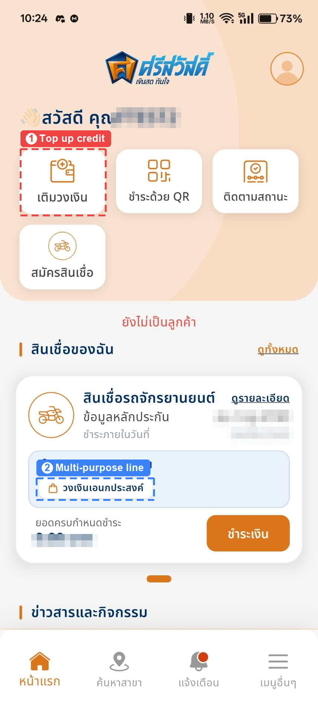

**(1)** `เติมวงเงิน`  
**TH** กดเพื่อเปิดหน้าเติมวงเงิน แล้วเลือกวงเงินอเนกประสงค์ที่หน้านั้น  
**EN** opens the top-up screen, where you then pick วงเงินอเนกประสงค์

**(2)** `วงเงินอเนกประสงค์`  
**TH** ปุ่มในกล่อง “สิทธิพิเศษเฉพาะคุณ” บนบัตรสัญญา กดเพื่อเข้าสู่ขั้นตอนการสมัครทันที  
**EN** in the สิทธิพิเศษเฉพาะคุณ box on the contract card — goes straight into the application

> **TH** ปุ่มนี้จะปรากฏบนบัตรของสัญญาที่เข้าเงื่อนไขเท่านั้น หากสัญญายังไม่เข้าเงื่อนไข หรือมีคำขออยู่แล้ว ระบบจะแจ้งเหตุผลเมื่อกดเข้าไป  
> **EN** The button appears only on a contract that qualifies. If the contract is not yet eligible, or already has a request open, the reason is shown when you continue.

### 1.2 หน้าเติมวงเงิน / The top-up screen

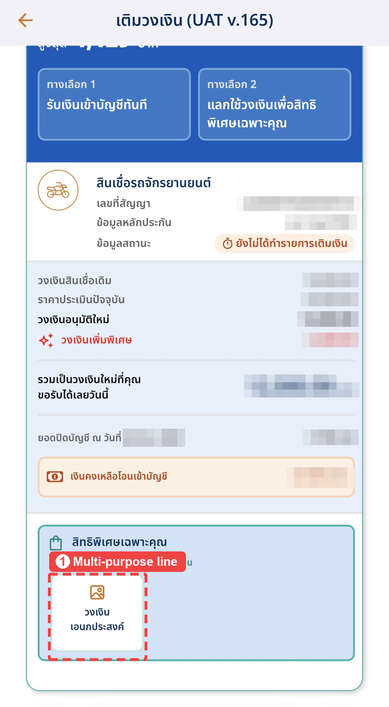

**(1)** `วงเงินอเนกประสงค์`  
**TH** กดปุ่มในกล่อง “สิทธิพิเศษเฉพาะคุณ” เพื่อเริ่มขอสินเชื่อเพิ่ม  
**EN** tap it in the สิทธิพิเศษเฉพาะคุณ box to start the application

**คำที่พบบนหน้านี้ · Terms on this screen**

| In app | ไทย | English |
|---|---|---|
| วงเงินสินเชื่อเดิม | วงเงินของสัญญาที่ท่านถืออยู่ | the limit on the contract you already hold |
| วงเงินอนุมัติใหม่ | วงเงินรวมที่อนุมัติให้สำหรับสัญญาใหม่ | the total limit approved for the new contract |
| วงเงินเพิ่มพิเศษ | วงเงินส่วนเพิ่มที่ได้รับเป็นสิทธิพิเศษ นี่คือยอดที่วงเงินอเนกประสงค์จะจัดให้ | extra headroom granted as a special offer — this is the amount วงเงินอเนกประสงค์ finances |
| เงินคงเหลือโอนเข้าบัญชี | จำนวนเงินที่จะโอนเข้าบัญชีจริง หากท่านเลือกเติมวงเงินแบบรับเงินสด | what reaches your bank account if you take the cash top-up instead |

> **TH** หน้านี้คือขั้นที่ 1 ของ 4 ขั้น เพราะเป็นหน้าที่แสดงวงเงินที่อนุมัติให้ท่านแล้ว เมื่อเข้าสู่ขั้นตอนถัดไป แถบขั้นตอนจะเริ่มนับจาก 2 ปุ่มย้อนกลับในหน้าจอถัดไปจะพาท่านกลับมาที่หน้านี้  
> **EN** This screen is step 1 of 4: it is where the approved amount is shown to you. The step bar on the following screens therefore starts at 2, and Back on the first of them returns you here.

---

## 2. ขั้นตอนการขอวงเงิน / Applying

**TH** สามขั้นตอน คือ เลือกจำนวนงวด → ตรวจสอบข้อมูลส่วนตัว → สรุปและยืนยัน ระหว่างทางมีการถ่ายรูปยืนยันตัวตน อ่านเอกสารสัญญา และลงนามด้วย NDID  
**EN** Three steps — pick a term, check your details, then review and confirm. Along the way you photograph your ID, read the contract documents and sign with NDID.

### 2.1 เลือกจำนวนงวด (ขั้นที่ 2) / Pick a term (step 2)

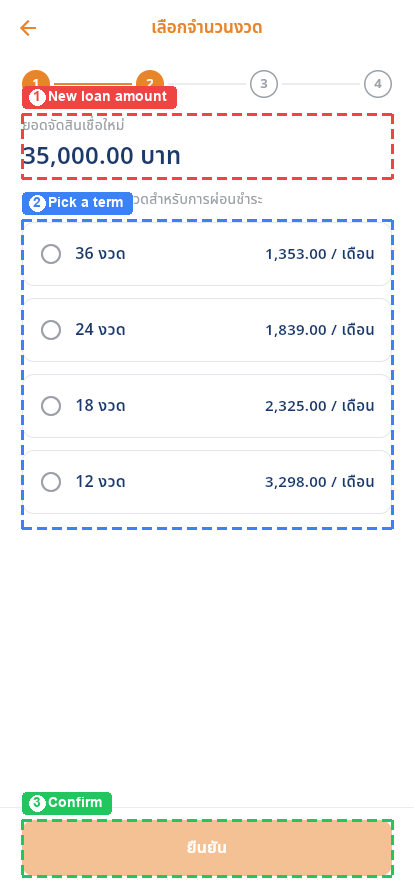

**(1)** `ยอดจัดวงเงินอเนกประสงค์`  
**TH** ยอดที่จะจัดสินเชื่อ มาจากวงเงินเพิ่มพิเศษที่อนุมัติในหน้าก่อนหน้า แก้ไขที่หน้านี้ไม่ได้  
**EN** the amount being financed, carried over from the special offer on the previous screen; it cannot be changed here

**(2)**  
**TH** เลือกจำนวนงวดหนึ่งรายการ ตัวเลขด้านขวาคือค่างวดต่อเดือนของงวดนั้น ยิ่งจำนวนงวดมาก ค่างวดต่อเดือนยิ่งน้อย  
**EN** choose one term; the figure on the right is the monthly payment for it — a longer term means a smaller monthly payment

**(3)** `ยืนยัน`  
**TH** กดได้เมื่อเลือกจำนวนงวดแล้ว ปุ่มจะเป็นสีเทาจนกว่าจะเลือก  
**EN** becomes active once a term is selected; it stays pale until then

> **TH** ภาพนี้บันทึกจากบิลด์รุ่นก่อน หัวข้อยอดเงินจึงเขียนว่า “ยอดจัดสินเชื่อใหม่” ปัจจุบันหน้าจอนี้เขียนว่า “ยอดจัดวงเงินอเนกประสงค์” ตำแหน่งและวิธีใช้เหมือนเดิม  
> **EN** This image is from an earlier build, where the amount was headed ยอดจัดสินเชื่อใหม่. The current app reads ยอดจัดวงเงินอเนกประสงค์ in the same place; nothing else about the screen changed.

### 2.2 ตรวจสอบข้อมูลส่วนตัว (ขั้นที่ 3) / Check your details (step 3)

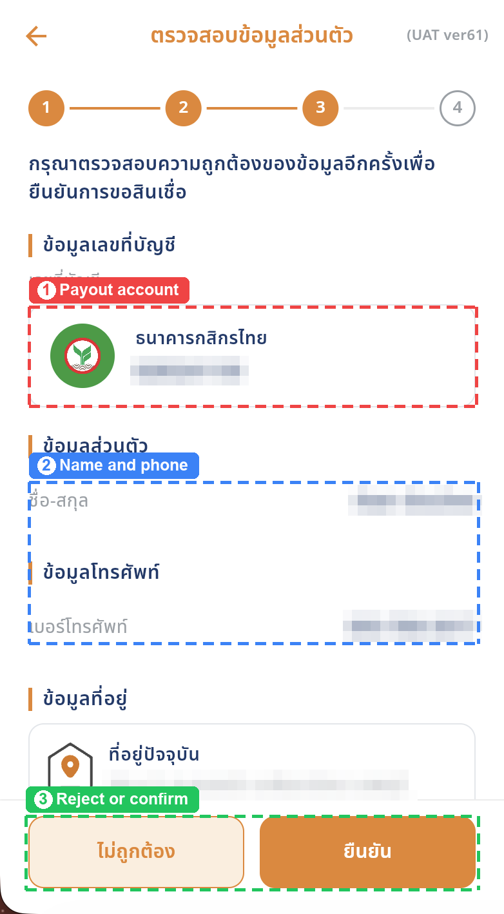

**(1)** `ข้อมูลเลขที่บัญชี`  
**TH** บัญชีที่จะรับเงิน ดึงมาจากสัญญาเดิมของท่าน  
**EN** the account the money goes to, taken from your existing contract

**(2)** `ชื่อ-สกุล / เบอร์โทรศัพท์`  
**TH** ชื่อเจ้าของสัญญา และเบอร์ที่ใช้ติดต่อและรับ SMS เกี่ยวกับคำขอนี้  
**EN** the account holder's name, and the number used to contact you about this request

**(3)** `ไม่ถูกต้อง / ยืนยัน`  
**TH** กด “ยืนยัน” หากข้อมูลถูกต้องทั้งหมด หากไม่ถูกต้อง กด “ไม่ถูกต้อง” แล้วติดต่อสาขาเพื่อแก้ไขก่อนสมัคร  
**EN** tap ยืนยัน if everything is right; if not, tap ไม่ถูกต้อง and have a branch correct it before applying

> **TH** เลื่อนหน้าจอลงเพื่อดูที่อยู่ทั้งสี่รายการ ดูหน้าถัดไป  
> **EN** Scroll down for all four addresses — see the next screen.

### 2.3 ที่อยู่ทั้งสี่รายการ / Your four addresses

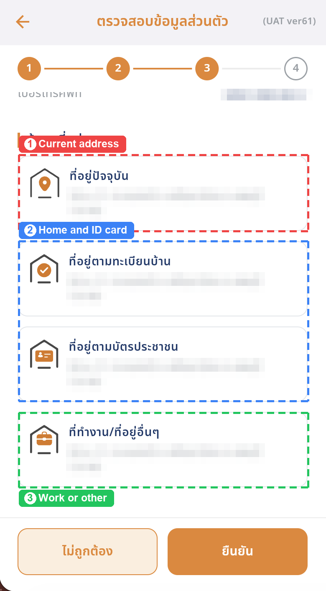

**(1)** `ที่อยู่ปัจจุบัน`  
**TH** ที่อยู่ที่ท่านพักอาศัยจริงในปัจจุบัน  
**EN** where you actually live now

**(2)** `ที่อยู่ตามทะเบียนบ้าน / ที่อยู่ตามบัตรประชาชน`  
**TH** ที่อยู่ตามเอกสารราชการ ทั้งสองรายการอาจซ้ำกับที่อยู่ปัจจุบันได้  
**EN** the addresses on your official records; either may repeat the current one

**(3)** `ที่ทำงาน/ที่อยู่อื่นๆ`  
**TH** ที่อยู่ที่ทำงาน หรือที่อยู่สำรองที่เคยแจ้งไว้  
**EN** your workplace, or any other address on file

> **TH** ที่อยู่ทั้งสี่รายการแก้ไขในแอปไม่ได้ หากรายการใดไม่ถูกต้อง กด “ไม่ถูกต้อง” ที่ด้านล่าง แล้วติดต่อสาขาเจ้าของบัญชีเพื่อแก้ไขก่อนสมัคร ช่องที่ไม่มีข้อมูลจะแสดงเป็นช่องว่าง ไม่ถือว่าผิดพลาด  
> **EN** None of the four can be edited in the app. If one is wrong, tap ไม่ถูกต้อง at the bottom and have the branch that owns your account fix it before you apply. An address the branch has never recorded simply shows blank — that is not an error.

### 2.4 ยืนยันบัญชีรับเงิน / Confirm the receiving account

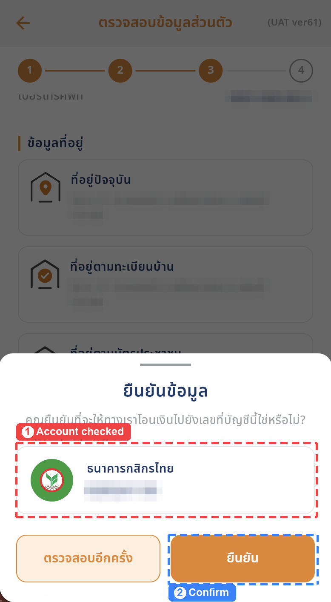

**(1)**  
**TH** ตรวจชื่อธนาคารและเลขที่บัญชีอีกครั้ง เงินจะโอนเข้าบัญชีนี้  
**EN** check the bank and account number once more — this is where the money is sent

**(2)** `ยืนยัน`  
**TH** กดเพื่อไปยังหน้าสรุป หรือกด “ตรวจสอบอีกครั้ง” เพื่อกลับไปดูข้อมูล  
**EN** continues to the summary; ตรวจสอบอีกครั้ง goes back to the details

### 2.5 สรุปรายละเอียดของสัญญา (ขั้นที่ 4) / Contract summary (step 4)

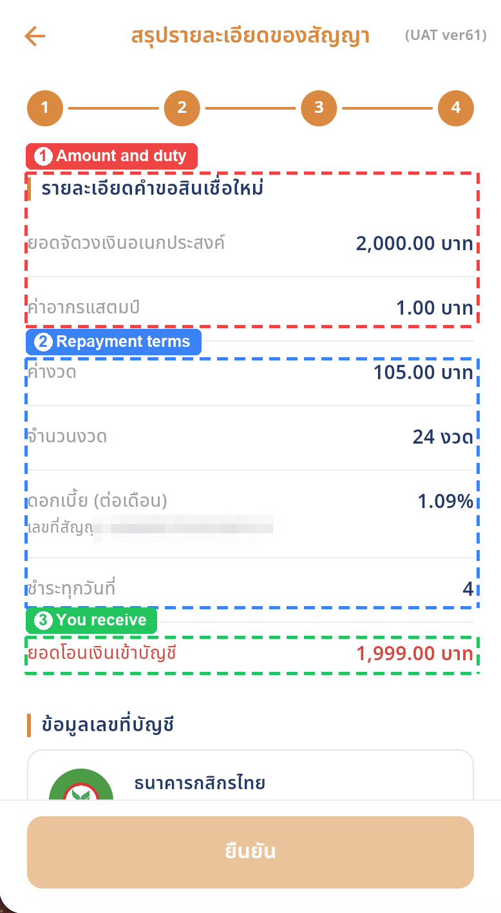

**(1)** `ยอดจัดวงเงินอเนกประสงค์ / ค่าอากรแสตมป์`  
**TH** ยอดที่จัดให้เต็มจำนวน และค่าอากรแสตมป์ตามกฎหมายที่หักจากยอดนั้น  
**EN** the full amount financed, and the statutory stamp duty deducted from it

**(2)**  
**TH** ค่างวด จำนวนงวด อัตราดอกเบี้ยต่อเดือน และวันที่ต้องชำระของสัญญาใหม่ ใต้บรรทัดดอกเบี้ยคือเลขที่สัญญาเดิมที่ใช้อ้างอิง  
**EN** the monthly payment, term, monthly interest rate and payment day of the new contract; under the interest line is the existing contract it references

**(3)** `ยอดโอนเงินเข้าบัญชี`  
**TH** ยอดที่จะโอนเข้าบัญชีของท่าน คือ ยอดจัดวงเงินอเนกประสงค์ ลบ ค่าอากรแสตมป์  
**EN** what is paid into your account: the amount financed minus the stamp duty

**รายการยอดเงินบนหน้าสรุป · The figures on the summary**

| In app | ไทย | English |
|---|---|---|
| ยอดจัดวงเงินอเนกประสงค์ | ยอดที่จัดให้ในสัญญาใหม่ เต็มจำนวน | the full amount financed under the new contract |
| ค่าอากรแสตมป์ | ค่าอากรตามกฎหมาย คิดจากยอดที่ท่านขอจริง | the statutory duty, calculated on the amount you actually requested |
| ค่างวด | ยอดที่ต้องชำระในแต่ละงวด | what you pay each month |
| ชำระทุกวันที่ | วันที่ของทุกเดือนที่ต้องชำระค่างวด | the day of the month the payment falls due |
| ยอดโอนเงินเข้าบัญชี | ยอดจัดวงเงินอเนกประสงค์ ลบ ค่าอากรแสตมป์ | the amount financed minus the stamp duty |

> **TH** หน้านี้ยาว ต้องเลื่อนลงไปทำอีกสามอย่างให้ครบก่อนจึงจะกดยืนยันได้ คือ ถ่ายรูปยืนยันตัวตน อ่านและยอมรับเอกสารสัญญา และลงนามด้วย NDID  
> **EN** This screen is long. Three more things further down must be completed before you can confirm: the identity photos, accepting the contract documents, and signing with NDID.

### 2.6 ถ่ายรูปยืนยันตัวตน / The identity photos

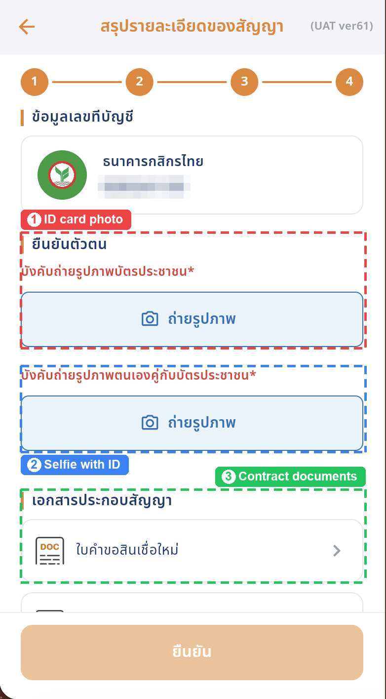

**(1)** `บังคับถ่ายรูปภาพบัตรประชาชน`  
**TH** ถ่ายรูปบัตรประชาชนของท่านเอง ระบบตรวจเลขบัตรให้ตรงกับเจ้าของสัญญา และตรวจว่าบัตรยังไม่หมดอายุ  
**EN** photograph your own ID card; the number is checked against the account holder and the card must not be expired

**(2)** `บังคับถ่ายรูปภาพตนเองคู่กับบัตรประชาชน`  
**TH** ถ่ายรูปตนเองพร้อมถือบัตรประชาชนให้เห็นหน้าและบัตรชัดเจน  
**EN** photograph yourself holding the ID card, with both your face and the card clearly visible

**(3)** `เอกสารประกอบสัญญา`  
**TH** ถัดลงมาคือเอกสารสัญญาสามฉบับ ที่ต้องเปิดอ่านและกดยอมรับ  
**EN** below them are the three contract documents you must open and accept

> **TH** ทั้งสองรูปเป็นข้อบังคับ กล้องจะเปิดจากในแอปศรีสวัสดิ์ พร้อมกรอบช่วยจัดตำแหน่ง ถ่ายในที่มีแสงพอ ให้เห็นตัวอักษรบนบัตรครบทุกบรรทัด  
> **EN** Both photos are required. The camera opens from inside the ศรีสวัสดิ์ app with a framing guide. Shoot in good light and make sure every line of text on the card is readable.

### 2.7 เมื่อแนบรูปแล้ว / Once the photos are attached

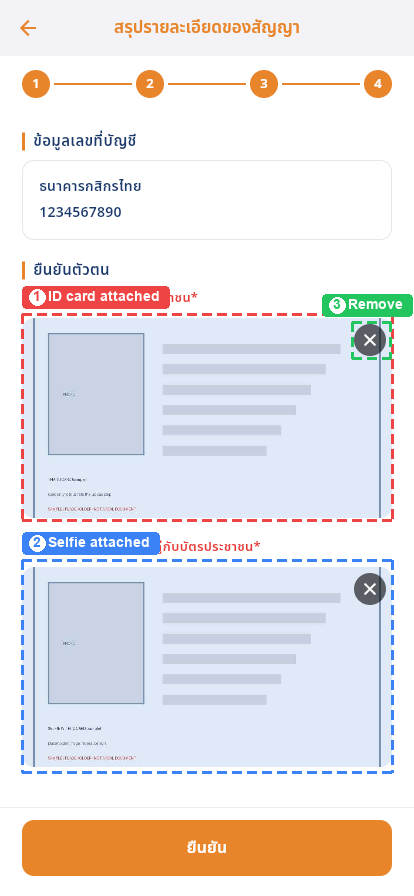

**(1)**  
**TH** รูปบัตรประชาชนที่แนบแล้วจะแสดงเป็นภาพตัวอย่าง  
**EN** the attached ID-card photo is shown as a thumbnail

**(2)**  
**TH** รูปตนเองคู่กับบัตรประชาชนที่แนบแล้ว  
**EN** the attached selfie-with-ID photo

**(3)**  
**TH** กดกากบาทเพื่อลบรูปและถ่ายใหม่  
**EN** tap the cross to delete a photo and retake it

> **TH** รูปในภาพตัวอย่างเป็นภาพสมมติที่สร้างขึ้นเพื่อทำคู่มือ ไม่ใช่บัตรจริงของผู้ใด หากระบบอ่านเลขบัตรไม่ได้ หรือเลขบัตรไม่ตรงกับเจ้าของสัญญา จะให้ถ่ายใหม่  
> **EN** The images in the sample are synthetic stand-ins made for this manual, not anyone's real card. If the number cannot be read, or does not match the account holder, you are asked to retake the photo.

### 2.8 เอกสารประกอบสัญญาและการลงนาม / The documents, and signing them

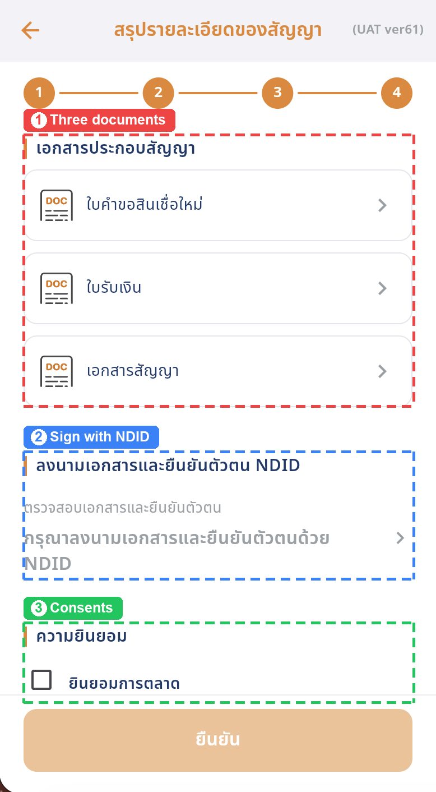

**(1)** `เอกสารประกอบสัญญา`  
**TH** สามฉบับ คือ ใบคำขอสินเชื่อใหม่ ใบรับเงิน และเอกสารสัญญา กดทีละฉบับเพื่อเปิดอ่านและกดยอมรับ  
**EN** three of them — the loan request form, the receipt and the contract. Tap each one to read it and accept it

**(2)** `ลงนามเอกสารและยืนยันตัวตน NDID`  
**TH** กดเพื่อเริ่มลงนามด้วย NDID แทนการเซ็นชื่อ  
**EN** starts NDID signing, which replaces a written signature

**(3)** `ความยินยอม`  
**TH** ช่องยินยอมสองข้อ อยู่ถัดลงไปอีกเล็กน้อย  
**EN** the two consent boxes, a little further down

> **TH** ต้องยอมรับเอกสารครบทั้งสามฉบับก่อน จึงจะกดลงนาม NDID ได้ หากกดก่อน ระบบจะแจ้งให้อ่านเอกสารให้ครบ — อ่านก่อน แล้วจึงลงนาม  
> **EN** All three documents must be accepted before NDID signing will open. Tapping it early tells you what is still missing — read first, then sign.

### 2.9 อ่านและยอมรับเอกสาร / Read and accept a document

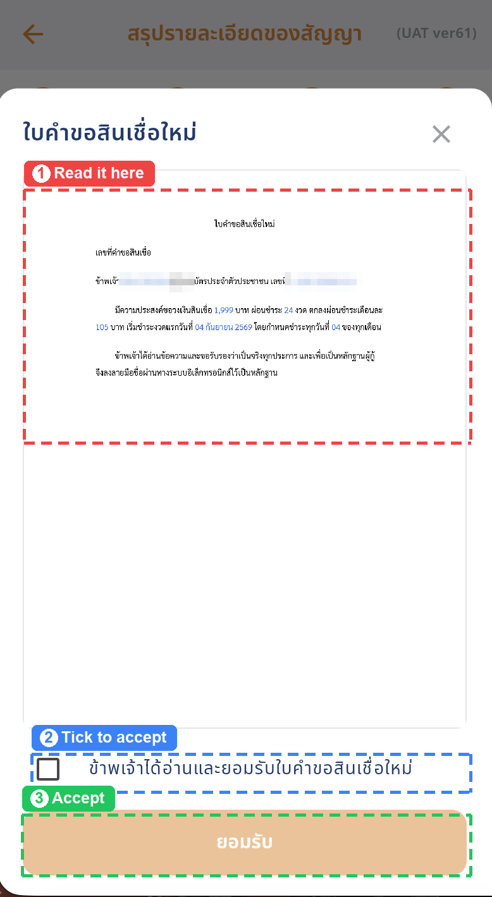

**(1)**  
**TH** เอกสารฉบับจริงแสดงในหน้าจอนี้ เลื่อนเพื่ออ่านทั้งฉบับ  
**EN** the real document is rendered here; scroll to read all of it

**(2)**  
**TH** ติ๊กช่องเพื่อรับรองว่าได้อ่านและยอมรับเอกสารฉบับนี้  
**EN** tick the box to confirm you have read and accept this document

**(3)** `ยอมรับ`  
**TH** กดเพื่อบันทึกการยอมรับ แล้วทำซ้ำกับเอกสารที่เหลือ  
**EN** records your acceptance; repeat for the remaining documents

> **TH** เอกสารอ่านได้ในแอปเท่านั้น ไม่มีปุ่มดาวน์โหลดและไม่มีปุ่มเปิดในแท็บใหม่ หากต้องการสำเนาเอกสารสัญญา ติดต่อสาขาเจ้าของบัญชี หรือโทร 1652  
> **EN** The document is readable in the app only — there is no download button and no open-in-a-new-tab button. For a copy of the contract, contact the branch that owns your account, or call 1652.

### 2.10 เลือกผู้ให้บริการยืนยันตัวตน NDID / Choose your NDID provider

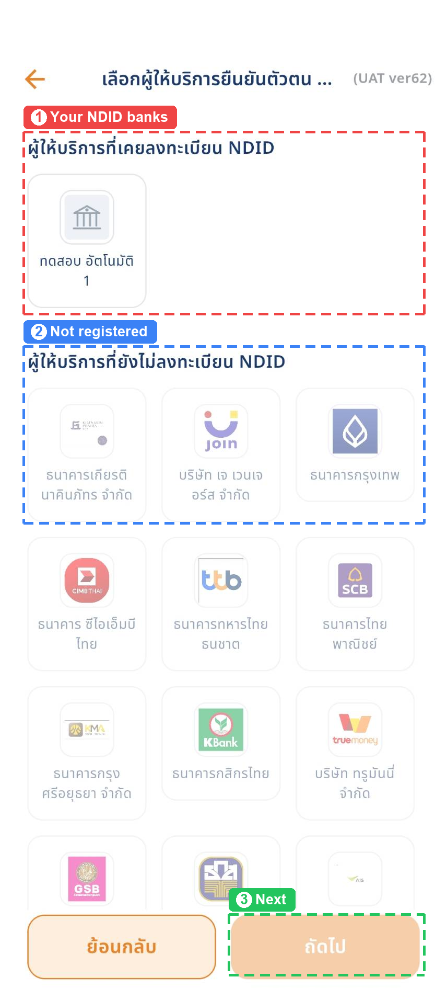

**(1)** `ผู้ให้บริการที่เคยลงทะเบียน NDID`  
**TH** เลือกธนาคารหรือผู้ให้บริการที่ท่านลงทะเบียน NDID ไว้แล้ว กดได้เฉพาะรายชื่อในกลุ่มนี้  
**EN** pick a bank or provider you have already registered with for NDID; only this group is tappable

**(2)** `ผู้ให้บริการที่ยังไม่ลงทะเบียน NDID`  
**TH** รายชื่อนี้เป็นสีจาง กดไม่ได้ ต้องไปลงทะเบียน NDID กับที่นั่นก่อน  
**EN** these are greyed out and cannot be selected; register for NDID with them first

**(3)** `ถัดไป`  
**TH** กดเมื่อเลือกแล้ว เพื่อส่งคำขอยืนยันตัวตน  
**EN** sends the verification request once one is selected

**NDID · NDID**

| In app | ไทย | English |
|---|---|---|
| NDID | บริการยืนยันตัวตนดิจิทัลผ่านธนาคารที่ท่านเป็นลูกค้า ใช้ลงนามเอกสารสัญญาแทนการเซ็นชื่อ | digital identity verification through a bank you already bank with, used here to sign the contract instead of a written signature |

> **TH** หากกลุ่มบนว่างเปล่า แปลว่าท่านยังไม่ได้ลงทะเบียน NDID กับที่ใดเลย ต้องไปลงทะเบียนกับธนาคารที่ท่านเป็นลูกค้าก่อน จึงจะทำขั้นตอนนี้ต่อได้ รายชื่อทั้งหมดดึงมาจากระบบ NDID จึงอาจต่างจากภาพนี้  
> **EN** An empty top group means you have not registered for NDID anywhere yet; register with a bank you hold an account at before continuing. The whole list comes live from NDID, so it may differ from this image.

### 2.11 รอยืนยันตัวตนในแอปธนาคาร / Waiting for the bank app

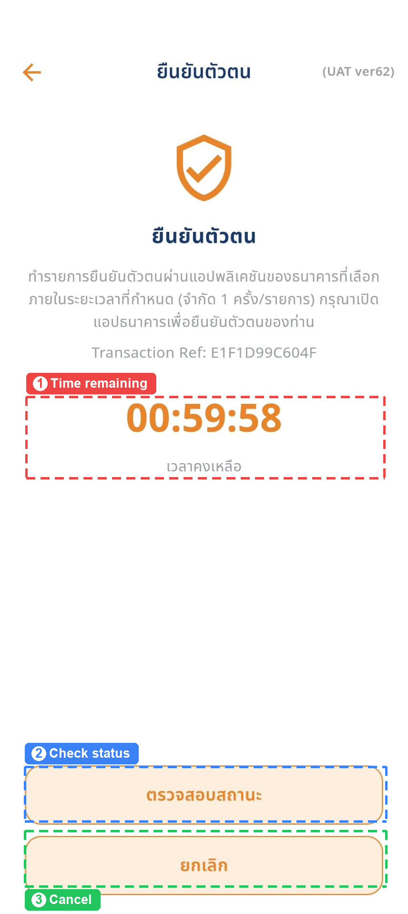

**(1)**  
**TH** เวลาที่เหลือสำหรับทำรายการ ต้องยืนยันในแอปธนาคารภายในเวลานี้ ทำได้ครั้งเดียวต่อหนึ่งรายการ  
**EN** the time left to finish; verify in the bank's app before it runs out — one attempt per request

**(2)** `ตรวจสอบสถานะ`  
**TH** กดเพื่อถามผลจากระบบทันที ใช้เมื่อยืนยันในแอปธนาคารเสร็จแล้ว แต่หน้านี้ยังนับถอยหลังอยู่  
**EN** asks for the result right away — use it if you finished in the bank app but this screen is still counting down

**(3)** `ยกเลิก`  
**TH** กดเพื่อยกเลิกคำขอยืนยันตัวตนนี้  
**EN** cancels this verification request

> **TH** ขั้นตอนนี้ทำในแอปของธนาคารที่ท่านเลือก ไม่ใช่ในหน้าจอนี้ เปิดแอปธนาคาร ทำตามขั้นตอนของธนาคาร แล้วกลับมายังหน้านี้ หน้าจอจะตรวจผลให้ทันทีที่กลับมา หรือกด “ตรวจสอบสถานะ” ก็ได้ บรรทัด Transaction Ref คือเลขอ้างอิงของรายการยืนยันตัวตนครั้งนี้  
> **EN** This step happens in your bank's own app, not on this screen. Open the bank app, follow its steps, then come back — the screen checks as soon as you return, and ตรวจสอบสถานะ checks on demand. The Transaction Ref line is this verification request's own reference.

### 2.12 ยืนยันตัวตนสำเร็จ / Verification succeeded

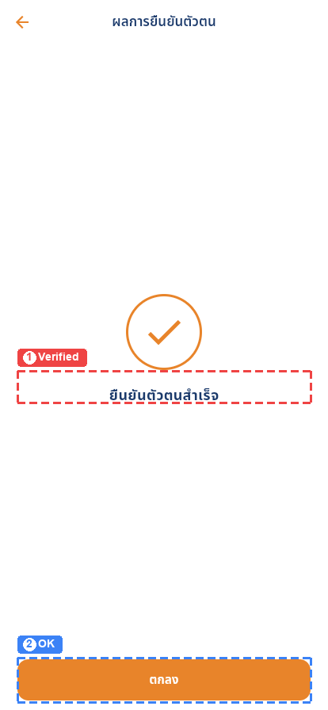

**(1)**  
**TH** ข้อความยืนยันว่าธนาคารตอบรับการยืนยันตัวตนแล้ว  
**EN** confirms the bank accepted the verification

**(2)** `ตกลง`  
**TH** กดเพื่อกลับไปยังหน้าสรุป  
**EN** returns you to the summary screen

> **TH** หากธนาคารปฏิเสธ หมดเวลา หรือท่านยกเลิก หน้านี้จะแจ้งข้อผิดพลาด และมีปุ่มให้ลองใหม่  
> **EN** If the bank rejects it, the request times out, or you cancel, this screen reports the error and offers a retry.

### 2.13 ความยินยอม และเหตุที่ปุ่มยืนยันยังกดไม่ได้ / The consents, and why ยืนยัน is still off

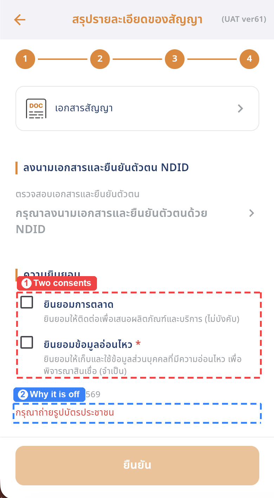

**(1)** `ยินยอมการตลาด / ยินยอมข้อมูลอ่อนไหว`  
**TH** “ยินยอมข้อมูลอ่อนไหว” มีดอกจันสีแดง เป็นข้อบังคับ ต้องติ๊กจึงจะยืนยันได้ ส่วน “ยินยอมการตลาด” เลือกได้ตามความสมัครใจ ไม่ติ๊กก็สมัครได้  
**EN** ยินยอมข้อมูลอ่อนไหว carries a red asterisk and is required — it must be ticked. ยินยอมการตลาด is genuinely optional and blocks nothing

**(2)**  
**TH** ข้อความสีแดงเหนือปุ่มบอกว่ายังขาดอะไร ในภาพนี้คือยังไม่ได้ถ่ายรูปบัตรประชาชน ทำสิ่งที่ขาดให้ครบ ข้อความจะหายไปและปุ่มจะกดได้  
**EN** the red line above the button names what is still missing — here, the ID-card photo. Finish it and the line disappears and the button becomes tappable

> **TH** การไม่ติ๊ก “ยินยอมการตลาด” เป็นคำตอบที่ระบบบันทึกจริง ไม่ใช่การข้าม ท่านจะไม่ถูกติดต่อเพื่อเสนอผลิตภัณฑ์  
> **EN** Leaving ยินยอมการตลาด unticked is recorded as a real answer, not skipped — you will not be contacted with product offers.

### 2.14 ตรวจความพร้อมก่อนยืนยัน / Ready to confirm

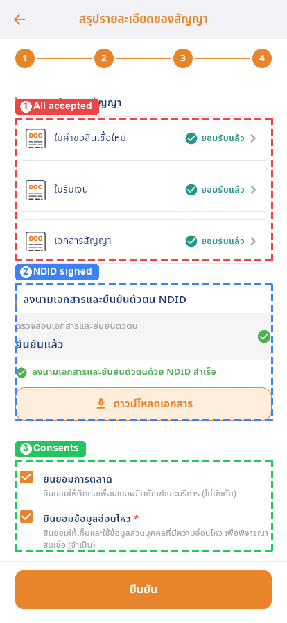

**(1)**  
**TH** เอกสารทั้งสามฉบับต้องขึ้น “ยอมรับแล้ว”  
**EN** all three documents must read ยอมรับแล้ว

**(2)**  
**TH** ช่อง NDID ต้องขึ้น “ยืนยันแล้ว” พร้อมเครื่องหมายถูกสีเขียว  
**EN** the NDID row must read ยืนยันแล้ว with a green tick

**(3)** `ความยินยอม`  
**TH** ช่อง “ยินยอมข้อมูลอ่อนไหว” ต้องถูกติ๊ก  
**EN** ยินยอมข้อมูลอ่อนไหว must be ticked

> **TH** เมื่อครบทุกข้อ ปุ่ม “ยืนยัน” ด้านล่างจะเปลี่ยนเป็นสีส้มเข้มและกดได้ ภาพนี้บันทึกจากบิลด์รุ่นก่อน จึงมีปุ่ม “ดาวน์โหลดเอกสาร” ใต้ช่อง NDID ปัจจุบันไม่มีปุ่มนั้นแล้ว — เอกสารอ่านได้ในแอปเท่านั้น  
> **EN** Once everything is done the ยืนยัน button turns solid orange and becomes tappable. This image is from an earlier build, so it still shows a ดาวน์โหลดเอกสาร button under the NDID row; the current app does not have it — the documents are read in the app only.

### 2.15 คำรับรองของผู้กู้ / The borrower's declaration

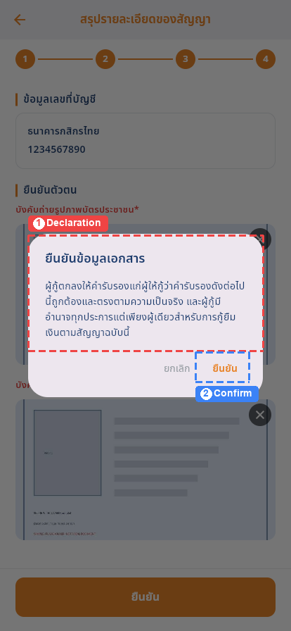

**(1)**  
**TH** ข้อความรับรองว่าข้อมูลที่ให้ไว้ถูกต้องและตรงตามความเป็นจริง และผู้กู้มีอำนาจทำสัญญานี้  
**EN** you declare that the information given is true and correct, and that you have the authority to enter this contract

**(2)** `ยืนยัน`  
**TH** กดเพื่อส่งคำขอ หลังจากนี้แก้ไขข้อมูลไม่ได้  
**EN** submits the request; nothing can be changed afterwards

### 2.16 ส่งคำขอเรียบร้อย / Request submitted

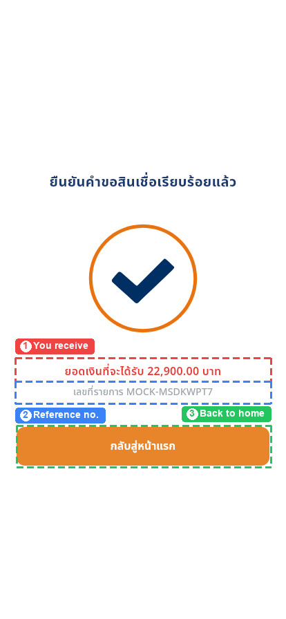

**(1)** `ยอดเงินที่จะได้รับ`  
**TH** ยอดสุทธิที่จะโอนเข้าบัญชีของท่าน  
**EN** the net amount that will be paid into your account

**(2)** `เลขที่รายการ`  
**TH** เลขอ้างอิงของคำขอ ใช้เมื่อต้องติดต่อสอบถามสถานะ แนะนำให้บันทึกไว้  
**EN** the request's reference number — keep it for any follow-up

**(3)** `กลับสู่หน้าแรก`  
**TH** กดเพื่อกลับไปยังแอปศรีสวัสดิ์  
**EN** returns you to the ศรีสวัสดิ์ app

> **TH** หลังส่งคำขอ สัญญานั้นจะขอสินเชื่อเพิ่มซ้ำอีกไม่ได้จนกว่าคำขอนี้จะเสร็จสิ้น ติดตามสถานะได้จากเมนู “ติดตามสถานะ” ในหน้าแรกของแอป  
> **EN** After submitting, that contract cannot raise another request until this one is finished. Track it from ติดตามสถานะ on the app's home screen.

---

## A. ข้อจำกัดของภาพและสิ่งที่ต้องทราบ / Capture notes and known limits

### A1 · ภาพหน้าจอบันทึกจากเครื่องจริงบนระบบ UAT / Screenshots come from a real device on UAT

**TH** ภาพส่วนใหญ่ในคู่มือนี้บันทึกเมื่อ 4 สิงหาคม 2569 จากโทรศัพท์จริง เดินตามเส้นทางจริง คือ แอปศรีสวัสดิ์ → หน้าเติมวงเงิน → วงเงินอเนกประสงค์ บนบิลด์เว็บรุ่น 61 และ 62 ของระบบทดสอบ UAT ตัวเลขที่เห็นจึงเป็นของคำขอจริงหนึ่งรายการ (จัดวงเงิน 2,000 บาท 24 งวด) เป็นเพียงตัวอย่าง ไม่ใช่เงื่อนไขที่เสนอให้ท่าน  
**EN** Most images here were captured on 4 August 2026 from a real phone, walking the real path — ศรีสวัสดิ์ app → top-up screen → วงเงินอเนกประสงค์ — on UAT web builds 61 and 62. The figures are therefore one real request (฿2,000 over 24 months). They are an example, not an offer.

### A2 · การปิดบังข้อมูลส่วนบุคคล / What is masked, and why

**TH** เพราะภาพมาจากบัญชีจริงบนระบบทดสอบ ทุกอย่างที่ระบุตัวบุคคลจึงถูกพิกเซลปิด คือ ชื่อ-สกุล เลขบัตรประชาชน เลขที่บัญชีธนาคาร เลขที่สัญญา เลขทะเบียนรถ เบอร์โทรศัพท์ และที่อยู่ทั้งสี่รายการ หัวข้อและโครงหน้าจอยังเห็นครบ ตัวเลขยอดเงินในบทที่ 2 ไม่ได้ปิด เพราะเป็นสิ่งที่คู่มืออธิบาย และไม่ระบุตัวผู้ใดเมื่อไม่มีชื่อกำกับ ส่วนภาพ 1.1 และ 1.2 ปิดตัวเลขด้วย เพราะแสดงฐานะสินเชื่อเดิมของลูกค้ารายนั้น หากต้องการฉบับที่ไม่ปิดบังเพื่อใช้ภายใน สร้างใหม่ได้จากไฟล์ต้นฉบับใน docs/raw/  
**EN** Because the captures come from a real account on the test system, everything that identifies a person is pixelated: name, national ID, bank account number, contract number, plate, phone number and all four addresses. Labels and layout are untouched. Money figures in chapter 2 are left readable — they are what the manual explains, and they identify nobody once the name and contract are gone. Images 1.1 and 1.2 do have their figures masked, because they show that customer's existing credit position. An unmasked rebuild for internal use is possible from the originals in docs/raw/.

### A3 · หกภาพยังเป็นบิลด์รุ่นก่อน / Six images are still from the earlier build

**TH** ภาพ 2.1, 2.7, 2.12, 2.14, 2.15 และ 2.16 ยังเป็นภาพชุดเดิม ที่บันทึกจากเบราว์เซอร์ บนข้อมูลจำลอง (สัญญา MOCK-M-6701001 ยอด 35,000 บาท) ตัวเลขจึงไม่ตรงกับภาพอื่น และมีสองจุดที่ต่างจากแอปปัจจุบัน คือ ภาพ 2.1 พาดหัวยอดเงินว่า “ยอดจัดสินเชื่อใหม่” ซึ่งตอนนี้เขียนว่า “ยอดจัดวงเงินอเนกประสงค์” และภาพ 2.14 ยังมีปุ่ม “ดาวน์โหลดเอกสาร” ซึ่งถูกถอดออกไปแล้ว ทั้งสองจุดมีหมายเหตุกำกับไว้ที่ภาพนั้นด้วย ลำดับขั้นตอนและปุ่มอื่นๆ ตรงกับของจริงทั้งหมด  
**EN** Images 2.1, 2.7, 2.12, 2.14, 2.15 and 2.16 are still the first edition's browser captures on fixture data (contract MOCK-M-6701001, ฿35,000), so their figures do not match the others. Two of them also differ from the current app: 2.1 heads the amount ยอดจัดสินเชื่อใหม่ where it now reads ยอดจัดวงเงินอเนกประสงค์, and 2.14 still shows a ดาวน์โหลดเอกสาร button that has since been removed. Both are flagged on the image itself. Everything else — the order, the other buttons — matches the live app.

### A4 · รายชื่อผู้ให้บริการ NDID ดึงมาสดจากระบบ / The NDID provider list is live

**TH** ตารางผู้ให้บริการในภาพ 2.10 ดึงมาจากระบบ NDID จริง ณ เวลาที่บันทึกภาพ รายชื่อและโลโก้ที่ท่านเห็นอาจต่างออกไป และกลุ่มบน “ผู้ให้บริการที่เคยลงทะเบียน NDID” จะแสดงเฉพาะที่ตรงกับเลขบัตรประชาชนของท่านเท่านั้น จึงว่างเปล่าได้ถ้าท่านยังไม่เคยลงทะเบียน  
**EN** The provider grid in image 2.10 was fetched live from NDID at capture time; the names and logos you see may differ. The top group shows only providers matched to your own national ID, so it is legitimately empty if you have never registered.

### A5 · เวลาให้บริการ 07:00–20:30 / Service hours are 07:00–20:30

**TH** ระบบเปิดให้ขอสินเชื่อเพิ่มเวลา 07:00 ถึง 20:30 เท่านั้น นอกเวลานี้จะขึ้นข้อความ “ท่านสามารถขอสินเชื่อได้ในเวลา 07:00 ถึง 20:30 เท่านั้น” เป็นเงื่อนไขของระบบหลังบ้าน ไม่ใช่ข้อผิดพลาดของแอป  
**EN** Top-up requests are only accepted between 07:00 and 20:30; outside that window the app shows the server's own message. This is a backend rule, not an app fault.

### A6 · บางสัญญายังขอสินเชื่อเพิ่มไม่ได้ / Some contracts are not eligible yet

**TH** หากสัญญายังไม่เข้าเงื่อนไข ระบบจะแจ้งว่า “ขออภัย รายการนี้ยังไม่สามารถทำผ่านแอปได้ กรุณาติดต่อสาขาเจ้าของบัญชี หรือโทร 1652” กรณีนี้ให้ติดต่อสาขาตามข้อความ ไม่ใช่ข้อผิดพลาดของแอป  
**EN** A contract that does not qualify returns the server's message telling the customer to contact the branch that owns the account, or call 1652. Follow the message — it is not an app fault.

---

*ภาพหน้าจอบันทึกจากเครื่องจริงบนระบบทดสอบ UAT · ข้อมูลที่ระบุตัวบุคคลถูกปิดบัง · 2026-08-04*